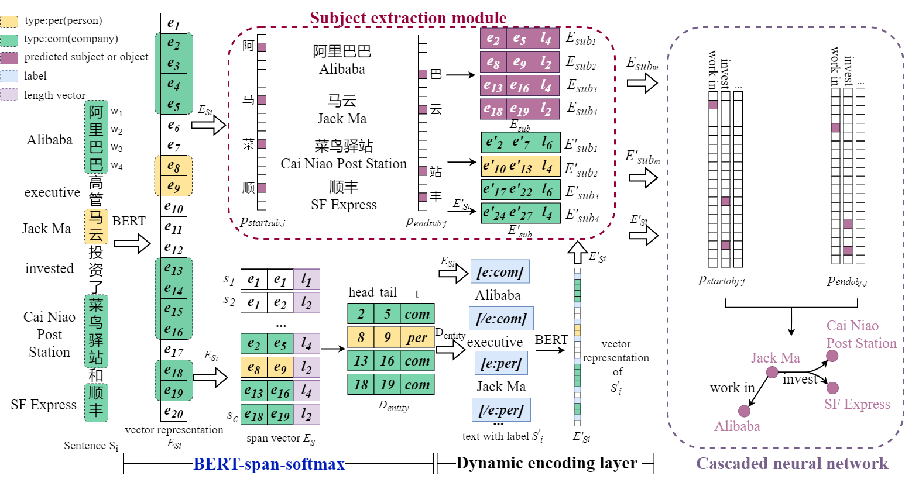

# Cascaded Pointer Networks for Financial Hyper-Relation Extraction with Entity Types
Source code of the  paper "E2CNN:Entity-Type-Enriched Cascaded Neural Network for Financial Hyper-Relation Extraction"

## Overview


In this work, we present a cascaded pointer networks approach for financial hyper-relation extraction which models relationship as functions that map subjects to objects and takes into account the entity's type information, to address the overlapping triple problem. Our approach contains two conponents:

1. NER model: Adopt a span-level entity extraction strategy which perform entity type prediction on all possible spans, effectively solving the problem of identifying nested entities in financial texts.
2. RE model: Adopt a cascaded pointer network relation extraction model fused with entity tags to make full use of the entity type feature.The network firstly extracts the relationship subject, then jointly extracts the relationship object and relationship type, which effectively solves the extraction of complex relationship types.

Please find more details of this work in our paper.

## Setup
### Requirements
Please install all the dependency packages using the following command:
```
pip install -r requirements.txt
```
### Pretrained models
Pretrained models need to be installed and placed in `./pretrain_models` as the base transformer model.We use `chinese-roberta-wwm-ext` as default base model for chinese dataset.
### Dataset
Our pre-trained model is based on the Chinese financial corpus FinCorpus.CN, and other open datasets mentioned in the paper are available at
```
DUIE:http://ai.baidu.com/broad/introduction
CLUENER2020:https://github.com/CLUEbenchmark/CLUENER2020
```
## NER model

### Input data format for NER model

The input data format of the NER model is JSONL. Each line of the input file contains one document in the following format.
```
{
  # document ID (please make sure the ID of each document is unique)
  "doc_key": "2",

  # sentences in the document, each sentence is a list of tokens.
  "sentences": [
    [...],
    [...],
    ["报", "告", "期", "内", "，", ...],
    ...
  ],

  # entities (boundaries and entity type) in each sentence
  "ner": [
    [...],
    [...],
    [[5, 8, "公司企业"], [13, 24, "公司企业"], ...],#the boundary positions are indexed in the document level
    ...,
  ],

  # relations (two spans and relation type) in each sentence
  "relations": [
    [...],
    [...],
    [[5, 8, 13, 24, "投资"]...],
    ...
  ]
}
```


### Train/evaluate a NER model

You can use `run_entity.py` with `--do_train` to train a NER model and with `--do_eval` to evaluate a NER model. 
The following commands can be used to train a NER models on FinCorpus.CN:
```
CUDA_VISIBLE_DEVICES=0 \
 python run_entity.py \
--do_train --do_eval --eval_test\
--learning_rate=1e-5 \
--task finance \
--model ./pretrain_models/chinese-roberta-wwm-ext \
 --data_dir ./entity_data/FinCorpus.CN \
--output_dir entity_output/FinCorpus.CN \
--context_window 0 --num_epoch 100 --max_span_length 26
```
Aruguments:
* `--task`:Determine the types of relationships that will appear in the dataset.All entity types for the corresponding task must be defined in `./shared/const.py`
* `--model`:the base transformer model.We use `chinese-roberta-wwm-ext` for chinese dataset.
* `--data_dir`:the input directory of the dataset.The prediction files (`ent_pred_dev.json` or `ent_pred_test.json`) of the entity model will be saved in this directory.
* `--output_dir`:the output directory of the entity model and logs.

## RE model

### Input data format for relation model

The input data format of the relation model is JSONL. Each line of the input file contains one document in the following format.
```
{
   # text:input sentence
    "text": "报告期内，亿利洁能投资设立宁波氢能创新中心有限公司（公司持股10%），积极布局氢能源产业。",

    # Relations(predicate), entity types(subject_type and object_type) and entity(subject and object) information
    "spo_list": [
        {
            "predicate": "投资",
            "subject_type": "公司企业",
            "object_type": "公司企业",
            "subject": "亿利洁能", 
            "object": "宁波氢能创新中心有限公司"
        }
    ]
    # predicted entities (boundaries and entity type) in sentences.(If there is no entity prediction file, the predicted entities will be set to all the correct entities involved in the sentence)
    "predict_entity":[
        [5, 8, "公司企业"]
        [13, 24, "公司企业"]
    ]
}
```
You can use following commands to convert the data format for NER model to data for RE model.
```
python entity_data/analyze_data/prediction2relation.py \
--pred_dir entity_data/FinCorpus.CN/ \
--output_dir relation_data/FinCorpus.CN/ 
``` 
Aruguments:
* `--pred_dir`:the directory of entity model prediction files.In order to classify relationships based on predicted entities,ent_pred_test.json and ent_pred_dev.json should be included.
* `--output_dir`:the output directory of the dataset.And the directory will be the input directory of relation model.
Besides,The entity types and relationship types involved in the dataset need to be predefined in JSONL files(entity.json, rel.json) and placed in the dataset folder.

### Train a relation model 
You can train the relational model with the default configuration by using `run_relation.py`
A trianing command template is as follow:
```
python run_relation.py \
--lr 1e-5 \
--batch_size 4 \
--max_epoch 10 \
--max_len 300 \
--dataset FinCorpus.CN \
--bert_name './pretrain_models/chinese-roberta-wwm-ext' \
--bert_dim 768 
```
Aruguments:
* `--dataset`:dataset name.The dataset needs to be placed in the corresponding folder under `./relation_data/`
* `--bert_name`:the base transformer model.We use `chinese-roberta-wwm-ext` for chinese dataset.
Other configurations can be viewed and modified in `./relation/config.py`
The prediction results will be stored in the file `result.json` in the folder `./results/`

### Evaluate a relation model 
You can use the following commands to evaluate the trained model
```
python Evaluate.py \
--dataset FinCorpus.CN
```

## Citation
If you use our code in your research, please cite our work:

## Support or Contact
E2CNN is developed in National Engineering Research Center for Big Data Technology and System, Cluster and Grid Computing Lab, Services Computing Technology and System Lab, School of Computer Science and Technology, Huazhong University of Science and Technology, Wuhan, China by Mengfan Li(limf@hust.edu.cn), Xuanhua Shi(xhshi@hust.edu.cn), Chenqi Qiao(qiaocq@hust.edu.cn), Weihao Wang(whwang2020@hust.edu.cn), Yao Wan(wanyao@hust.edu.cn), Hai Jin(hjin@hust.edu.cn) and Department of Computing, The Hong Kong Polytechnic University by Xiao Huang(xiaohuang@comp.polyu.edu.hk)
